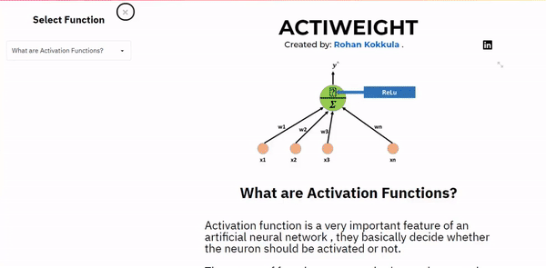

# Actiweight
## An Interactive WebAPP to build intuitive learning for Neural Network Activation Functions.

## Steps to run on localhost:
1. Clone this repository and enter into its directory 
Open terminal and enter
2. `pip install -r requirements.txt`
3. `streamlit run actiweight.py`

## Steps to run on heroku:
1. Add these files to your github repo.
2. Select ADD APP on Heroku website
3. Enter github repository link
4. Deploy Branch. That's it.!
